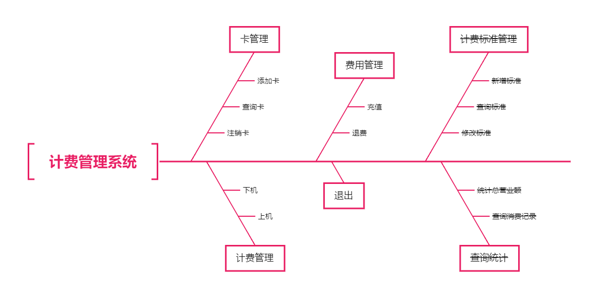
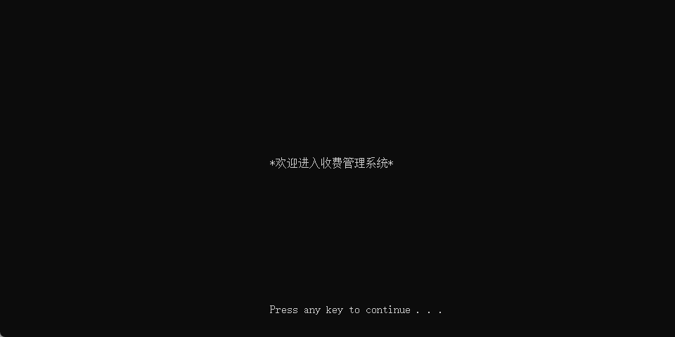
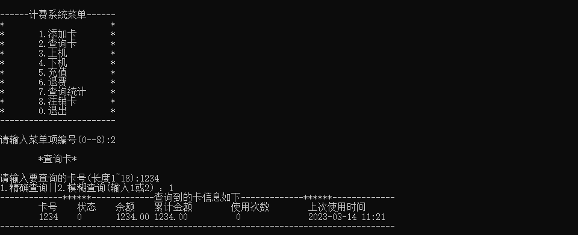
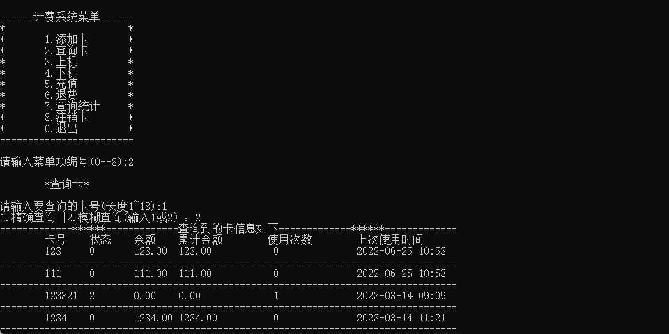
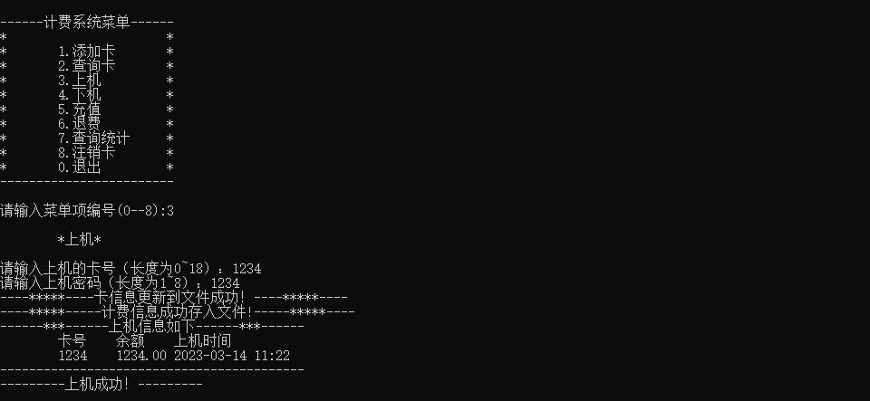
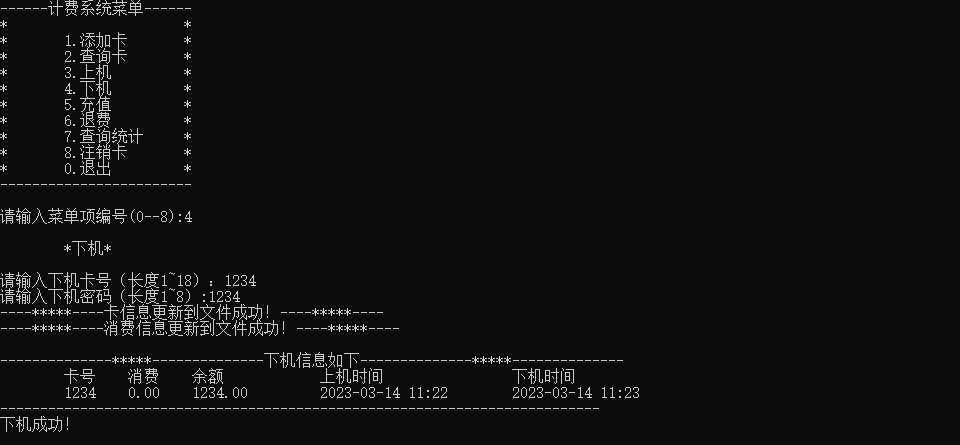
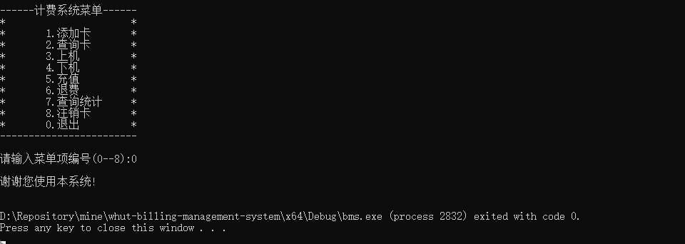

<p align="center">
    
    
    <a href="https://github.com/springbear2020/whut-billing-management-system" target="_blank">
    	
    </a>
</p>


# 一、快速开始

1. 克隆仓库：使用 Git 克隆仓库或直接下载仓库压缩包到您的计算机。
2. 打开工程：使用 VisualStudio2019 打开工程解决方案文件 bms.sln。
3. 运行项目：在 VisualStudio2019 中使用快捷键 Ctrl+F5 即可运行。

# 二、项目介绍

计费管理系统是一个控制台应用程序，它的主要应用场景是网吧、机房、电子阅览室等。项目是一个基于 C 语言的控制台应用程序，使用 VisualStudio2019 作为集成开发环境，综合运用 C 语言基础语法知识、函数、数组、指针、结构体、链表、文件操作等技术。核心功能是实现对数据的基本维护和统计分析。核心业务是实现通过输入卡号和密码进行上机，同时开始计费，在用户下机时实现对费用的计算结算操作，并通过本地文件操作保存相关信息。

# 三、组织结构
```lua
whut-billing-management-system -- 工程文件
|—— bms -- 源码目录
	|—— billingxxx    -- 计费相关
	|—— cardxxx       -- 卡操作
	|—— global.h      -- 全局常量
	|—— menuxxx       -- UI 菜单
	|—— model.h       -- 结构体
	|—— moneyxxx      -- 费用文件操作
	|—— servicexxx    -- 核心业务服务
	|—— tool          -- 工具函数
	|—— data          -- 业务数据目录
|—— document -- 资源文件
	|—— img           -- 系统效果展示图片
	|—— pdf           -- 项目开发指导文件
|—— bms.sln -- 工程解决方案
```

# 四、功能架构



# 五、项目迭代

阶段一：基础知识，创建项目框架结构，进行界面设计及数据结构设计。

1. 创建工程：创建控制台空工程，输出 “计费管理系统”。
2. 主页面：在控制台界面循环显示选择菜单，并输出用户选择的菜单名称。
3. 搭建程序框架：根据三层结构的思路，设计程序的结构。
4. 数据结构设计：根据需求，分析和设计系统数据结构。

阶段二：结构体、链表及文件，分别使用结构体、链表和文件实现卡管理功能。

1. 结构体数组管理卡：用结构体数组实现添加卡和查询卡。
2. 链表管理卡：用链表实现添加卡和查询卡。
3. 文件卡管理：用文件实现添加卡和查询卡。

阶段三：综合应用，采用迭代的思想，逐步实现综合系统。

1. 上机：可以上机的卡上机后，在界面输出上机信息，并将上机卡的消费信息用二进制文件保存到磁盘。
2. 下机：根据上机时间、下机时间和计费标准计算消费金额，更新文件中的卡信息和消费金额。
3. 注销卡：将不再使用的卡进行注销处理，如果卡中尚有余额进行退费操作。

# 六、效果展示

## 6.1 系统界面

1. 欢迎界面

   

2. 操作菜单

   

## 6.2 卡管理

1. 添加卡

   

2. 查询卡：支持精确查询卡和模糊查询卡

   - 精确查询卡

     

   - 模糊查询卡

     

3. 注销卡：将不再使用的卡进行注销处理，如果卡中尚有余额进行退费操作。

   

## 6.3 计费管理

根据卡号和密码可以进行上机，包括普通用户上机和特殊用户上机。通过卡号和密码也可以进行下机，结算时按照计费标准进行结算。

1. 上机：可以上机的卡上机后，在界面输出上机信息，并将上机卡的消费信息用二进制文件保存到磁盘。

   

2. 下机：根据上机时间、下机时间和计费标准计算消费金额，更新文件中的卡信息和消费金额。

   

## 6.4 费用管理

对未注销和未失效的卡进行充值和退费。到了截止日期的卡，系统会自动将该卡的状态修改为 “失效” 状态，对于已经失效的卡，若卡内还有余额，则只能进行退费操作，不能再进行其它操作。

1. 充值

   

2. 退费

   

## 6.5 退出系统



# 七、许可证

```
MIT License

Copyright (c) 2023 Spring-_-Bear

Permission is hereby granted, free of charge, to any person obtaining a copy
of this software and associated documentation files (the "Software"), to deal
in the Software without restriction, including without limitation the rights
to use, copy, modify, merge, publish, distribute, sublicense, and/or sell
copies of the Software, and to permit persons to whom the Software is
furnished to do so, subject to the following conditions:

The above copyright notice and this permission notice shall be included in all
copies or substantial portions of the Software.

THE SOFTWARE IS PROVIDED "AS IS", WITHOUT WARRANTY OF ANY KIND, EXPRESS OR
IMPLIED, INCLUDING BUT NOT LIMITED TO THE WARRANTIES OF MERCHANTABILITY,
FITNESS FOR A PARTICULAR PURPOSE AND NONINFRINGEMENT. IN NO EVENT SHALL THE
AUTHORS OR COPYRIGHT HOLDERS BE LIABLE FOR ANY CLAIM, DAMAGES OR OTHER
LIABILITY, WHETHER IN AN ACTION OF CONTRACT, TORT OR OTHERWISE, ARISING FROM,
OUT OF OR IN CONNECTION WITH THE SOFTWARE OR THE USE OR OTHER DEALINGS IN THE
SOFTWARE.
```
